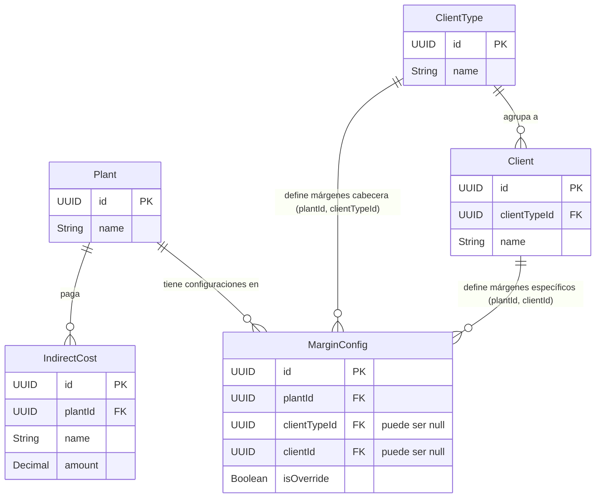

# Diseño de Base de Datos y Relaciones

Para soportar la funcionalidad de configuración de márgenes (con herencia y sobreescritura manual) y la gestión de costos indirectos, el diseño de la base de datos se estructura en 5 entidades principales.

## 1. Diseño de Tablas

### `Plant` (Planta)
Representa la ubicación geográfica o sede (ej. Perú, Colombia, Chile). Es el nodo raíz del cual dependen las configuraciones financieras.
- `id`: UUID (PK)
- `name`: String (Unique)

### `ClientType` (Tipo de Cliente / Cabecera)
Representa las categorías globales de clientes (Tipo A, Tipo B, Tipo C, Sin tipo). Contiene los datos base que heredarán sus empresas dependientes.
- `id`: UUID (PK)
- `name`: String (Unique)
- `pricePerColor`: Decimal (Precio base por color)
- `priceLinkType`: String (Regla de vinculación, ej: "Por estructura")

### `Client` (Empresa)
Representa a la empresa final (ej. "KROWDY", "DEVELOP INC").
- `id`: UUID (PK)
- `name`: String
- `clientTypeId`: UUID (FK a `ClientType`)
- `pricePerColor`: Decimal (Puede ser distinto a su cabecera)
- `priceLinkType`: String

### `MarginConfig` (Configuración de Márgenes)
Almacena los porcentajes de margen para los 8 rangos de volumen fijos (300kg, 500kg, 1T, 3T, 5T, 10T, 20T, 30T). La flexibilidad de esta tabla es crucial: puede pertenecer a un `ClientType` (actuando como cabecera) o a un `Client` directo (actuando como override).
- `id`: UUID (PK)
- `plantId`: UUID (FK a `Plant`)
- `clientTypeId`: UUID (Nullable, FK a `ClientType`)
- `clientId`: UUID (Nullable, FK a `Client`)
- `vol300` a `vol30T`: Decimal (Los 8 porcentajes)
- `isOverride`: Boolean (Bandera para saber si rompe la herencia)

### `IndirectCost` (Costo Indirecto)
Almacena los gastos operativos fijos de una planta.
- `id`: UUID (PK)
- `plantId`: UUID (FK a `Plant`)
- `name`: String (ej. "Alquiler", "Luz")
- `amount`: Decimal

---

## 2. Relación entre la Entidades

El modelo está diseñado para soportar la lógica de **Herencia con Sobreescritura (Override)**.

### Explicación del funcionamiento (La lógica de negocio)

1. **La Planta es el Eje Central (`Plant`):** Todas las finanzas dependen del país. Por eso `MarginConfig` y `IndirectCost` tienen llave foránea obligatoria hacia `Plant`.
2. **Jerarquía de Clientes (`ClientType` 1 → N `Client`):** Un tipo de cliente agrupa a múltiples empresas.
3. **El Polimorfismo de `MarginConfig`:**
   - Si una fila tiene `clientTypeId` lleno y `clientId` vacío: Representa los márgenes **globales** de esa categoría para esa planta en específico.
   - Si una fila tiene `clientId` lleno y `clientTypeId` vacío: Representa los márgenes **específicos** de una empresa.
4. **La regla de Herencia y el campo `isOverride`:**
   - Por defecto, las filas de `MarginConfig` atadas a un `Client` tienen `isOverride = false`. Cuando se edita la cabecera (`ClientType`), el backend actualiza automáticamente a todos sus hijos que tengan `isOverride = false`.
   - Si un usuario edita manualmente la celda de una empresa específica, el backend marca `isOverride = true` para esa fila. A partir de entonces, esa empresa "se independiza" y deja de escuchar los cambios de su cabecera padre.
